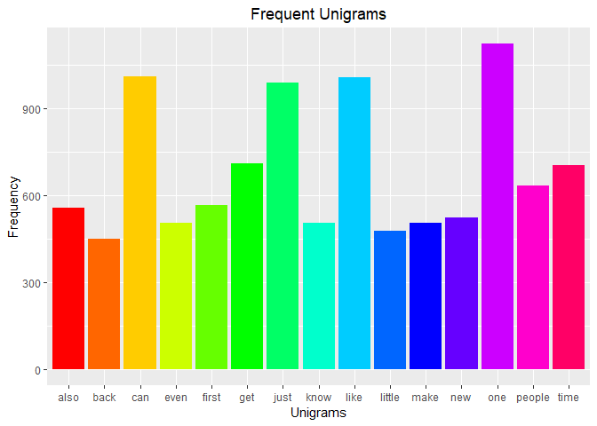
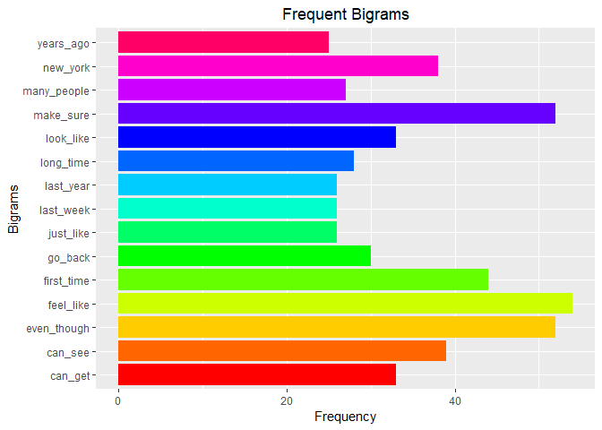
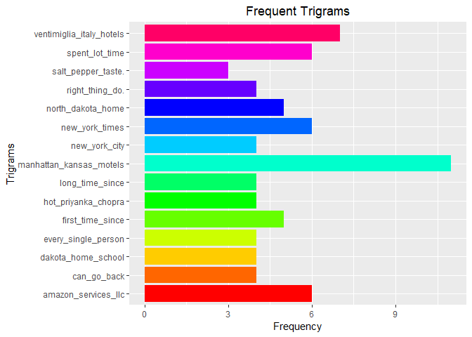

##Introduction

This is the first milestone report in the Coursera Data Science Specialization Capstone course. A large corpus of text will be used to explore Natural Language Processing (NLP). This report addresses cleaning the data in the corpus and exploratory data analysis.

##Load the Data

The following libraries will be used to clean and explore the corpus.


```r
suppressMessages(library(ggplot2))
suppressMessages(library(tm))
suppressMessages(library(quanteda))
```

The corpora were collected from publicly available sources by a web crawler. The data is stored in the following text files:

* en_US.blogs.txt
* en_US.news.txt
* en_US.twitter.txt


```r
blogs_data<-readLines("final/en_US/en_US.blogs.txt", encoding = "UTF-8", skipNul = TRUE)

news_data<-readLines("final/en_US/en_US.news.txt", encoding = "UTF-8", skipNul = TRUE, warn = FALSE)

twitter_data<-readLines("final/en_US/en_US.twitter.txt", encoding = "UTF-8", skipNul = TRUE)
```

##Premilinary Aspects of the Data

The following aspects of the data will help us understand the data with which we are working.

###File Size


```r
blogs_size<-file.size("final/en_US/en_US.blogs.txt")/2^20
news_size<-file.size("final/en_US/en_US.news.txt")/2^20
twitter_size<-file.size("final/en_US/en_US.twitter.txt")/2^20
```

###Number of Lines


```r
blogs_lines<-length(blogs_data)
news_lines<-length(news_data)
twitter_lines<-length(twitter_data)
```

###Length of the Longest Line


```r
blogs_max<-max(nchar(blogs_data))
news_max<-max(nchar(news_data))
twitter_max<-max(nchar(twitter_data))
```

##Summary

The results of the preliminary analysis is diplayed in the following data frame.


```r
data.frame(file = c("blogs", "news", "twitter"),
           file_size = c(blogs_size, news_size, twitter_size),
           num_lines = c(blogs_lines, news_lines, twitter_lines),
           char_max = c(blogs_max, news_max, twitter_max))
```

```
##      file file_size num_lines char_max
## 1   blogs  200.4242    899288    40833
## 2    news  196.2775     77259     5760
## 3 twitter  159.3641   2360148      140
```

##Process the Data

###Sample the Data

Due to the size of the files, we will sample 1% of the lines from each file.


```r
set.seed(3878)
dataSample<-c(sample(blogs_data, size = blogs_lines * 0.01),
              sample(news_data, size = news_lines * 0.01),
              sample(twitter_lines, size = twitter_lines * 0.01))
```

###Clean the Data

Before performing exploratory data analysis, the data must be cleaned. Cleaning the data will include removing URL's, special characters, punctuations, numbers, stopwords, and converting the text to lower case.


```r
dataTokens<-tokens(dataSample,
               what = "fasterword",
               remove_url = TRUE,
               remove_punct = TRUE,
               remove_numbers = TRUE,
               remove_twitter = TRUE)
dataTokens<-tokens_remove(dataTokens, pattern = stopwords("en"))
dataTokens<-tokens_tolower(dataTokens)
```

##Exploratory Analysis

The exploratory analysis will consist of finding the frequency of words occuring in the data. We will look for the frequency of single words, unigrams, the frequency of pairs of words, bigrams, and the frequency of three word groups, trigrams.

###Unigram Plot


```r
unigram<-tokens_ngrams(dataTokens, n = 1)
unigramMat<-dfm(unigram, verbose = FALSE)
unigramSort<-topfeatures(unigramMat, 15)
unigramDF<-data.frame(words = names(unigramSort), freq = unigramSort)

ggplot(data = unigramDF, aes(x = words, y = freq)) +
    geom_bar(stat = "identity", fill = rainbow(n = length(unigramDF[, 1]))) +
    ggtitle("Frequent Unigrams") +
    theme(plot.title = element_text(hjust = 0.5)) +
    xlab("Unigrams") +
    ylab("Frequency")
```

<!-- -->

###Bigram Plot


```r
bigram<-tokens_ngrams(dataTokens, n = 2)
bigramMat<-dfm(bigram, verbose = FALSE)
bigramSort<-topfeatures(bigramMat, 15)
bigramDF<-data.frame(words = names(bigramSort), freq = bigramSort)

ggplot(data = bigramDF, aes(x = words, y = freq)) +
    geom_bar(stat = "identity", fill = rainbow(n = length(bigramDF[, 1]))) +
    coord_flip() +
    ggtitle("Frequent Bigrams") +
    theme(plot.title = element_text(hjust = 0.5)) +
    xlab("Bigrams") +
    ylab("Frequency")
```

<!-- -->

###Trigram Plot


```r
trigram<-tokens_ngrams(dataTokens, n = 3)
trigramMat<-dfm(trigram, verbose = FALSE)
trigramSort<-topfeatures(trigramMat, 15)
trigramDF<-data.frame(words = names(trigramSort), freq = trigramSort)

ggplot(data = trigramDF, aes(x = words, y = freq)) +
    geom_bar(stat = "identity", fill = rainbow(n = length(trigramDF[, 1]))) +
    coord_flip() +
    ggtitle("Frequent Trigrams") +
    theme(plot.title = element_text(hjust = 0.5)) +
    xlab("Trigrams") +
    ylab("Frequency")
```

<!-- -->

##Prediction Algorithm and Shiny App

1. The data will have to be split into training and test datasets.
2. The ngrams may need to be increased in order to build an effective prediction.
3. The model will have to address instances in which a user input is not contained in the observed data.
4. The model will have to be assessed on both relibility of the predition and resource usage.
5. Build the Shiny text prediction app and publish it.
6. Create a slide deck detailing the use of the Shiny app.
